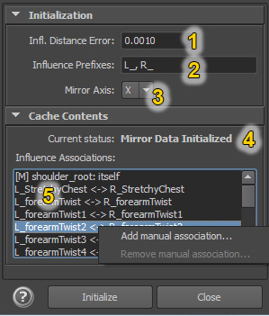
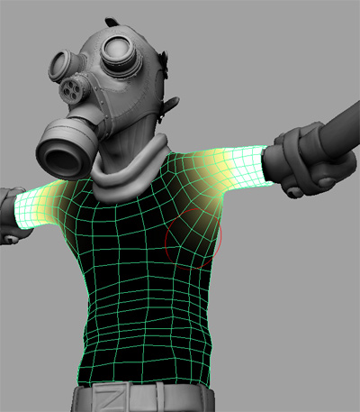
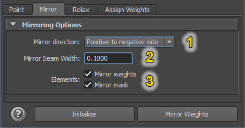

Mirroring Weights
=================

Mirroring skin weights is an important part of skinning workflow. NgSkinTools has it's own mirroring implementation, with a few differences to Maya's "Mirror Skin Weights" tool.

Initialization
---------------
To be able to mirror weights with ngSkinTools, first an initialization of influence and vertex associations is necessary. In this step, plugin figures out how vertices and influences map onto the opposite side of the rig, and caches that information for later use.

To perform initialization:

* Go to "Init Skin Transfer" dialog;
  
  .. image:: layers/mirror-initialize-button.jpg
	
* Put the character in default (bind) pose; precision is important because mesh associations (left to right and right to left) will be decided based on current pose; influence associations also will be using current joint positions as well;

  .. image:: layers/t-pose.jpg

* Edit influence association options (explained below);
* Click "Initialize"; plugin will read mesh and influences positions, and create an internal set of rules of how one side of your rig maps onto the other side;

  .. image:: layers/init-mirror-2.jpg
	
* Review how influences map onto each other; if you think that some influences are not finding it's pair, or should not be paired with any other influence, add manual association overrides.

  .. image:: layers/infl-associations.jpg

* When you're happy with influence association map, you can close initialization window and start using mirror tool.

Initialization has to be repeated each time you add or remove influences to a skin cluster; plugin will warn you when cached data becomes outdated.

Initialization Options
----------------------

1. **Influence distance error**: when matching influences by position, this defines the overall tolerated inaccuracy. Try keeping this value low, as increasing it might allow influences being associated with wrong pair. In general, influences should be matched with closest available influence on the other side.

2. **Influence prefixes**: when matching influences by name, these are prefixes that will be ignored. For example, if your naming convention for left and right influences is ``L_wrist``, ``R_wrist``, set prefixes to ``L_,R_``;

3. **Mirror Axis**: normally, "left-right" axis is X, while Y is "top-bottom", and Z is "front-back". Note that you don't have to define mirroring direction  ("left to right or right to left?") in this step yet.

4. **Current Status**: displays current state of mirror cache status.

5. **Influence Associations**: a list of how influences map from one side to another. Entries might look like this:
	
	- ``L_joint1 <-> R_joint1``: bi-directional association: weights of L_joint1 on one side will become weights of R_joint1 on another side, and vice versa;
	- ``L_joint2 -> R_joint1``:  weights of L_joint2 on one side will become weights of R_joint1 on another side, but that's not the case the other way around. This mostly happens when one side has more joints than another side, then you end up with a rule list ``L_joint1 <-> R_joint1``, ``L_joint2 -> R_joint1``;
	- ``hipJoint: itself``: joint does not map to another joint, and when mirroring, weights on this joint become symmetrical on both sides. That's usually joints that don't have their mirror counterpart and are on the mirror plane themselves, e.g. spine or neck.
	
"Influence Associations" popup menu
~~~~~~~~~~~~~~~~~~~~~~~~~~~~~~~~~~~

* **Add manual association**: define influence association manually; in the dialog that opens, select source influence, destination influence, specify if you want bidirectional, one-sided or self-reference association, and click add. Manual associations are displayed with an "``[M]``" prefix.

* **Remove manual association**: removes selected manual association; influences again become subject to automatic association rules. 
	
.. note:: for convenience, manual influence association rules are saved in scene file and will be remembered next time rig is opened.

Mirroring
----------

When mirroring info is initialized, weights are ready to be mirrored. This can be done in any pose of the rig, thanks to pre-cached mirroring associations. To mirror weights:

* In layer list, select the layer to be mirrored (most often that will just be the current layer you're painting weights on at that moment);
* Decide which direction are you mirroring to, and select the appropriate option;
* Click mirror!

Mirror Options
--------------

1. **Mirror Direction**: specifies if weights should be copied from left side to the right, or the other way around (same goes for top to bottom or front to back, should you choose another mirroring axis); 
	+ ``Guess from stroke`` - mirroring direction will be guessed automatically. If last paint stroke edited weights on the left side, weights will be copied to the right, and vice versa. Strokes or actions that edit both sides will be ignored; if you edit left side, and then flood weights, it will still resolve to "left->right" direction.
	
	  .. note:: For this feature to work, mirroring info should be initialized before the stroke, otherwise the tool is not aware which side is which!
	  
	+ ``Positive to negative side`` or ``Negative to positive side``: define mirroring direction manually. 
	
#. **Mirror Seam Width**: defines seam width (in scene distance units) between two sides; this allows for some automatic smoothing on vertices that are near mirror axis.

   .. figure:: layers/mirror-seam-width.jpg 
   		
   		on the left: mirror result with seam width = 0.0001; on the right - 2.0; increasing seam width helped smooth weights between left and right sides automatically.

   .. note:: This smoothing is not the same as applying some smooth on mirror axis after mirroring. Internally what happens is that on the seam axis, a flipped version of weights is blended together with original. Take a look at the picture below:
   
       .. figure:: layers/mirror-seam-explained.jpg
       
       On the left, asymmetric weighting between two influences. On the right, result of mirroring with a large seam width. You can see that it's not a straightforward blur, but rather a blend of original and flipped version of weights.
   
       It's not necessary to understand how this feature works internally, though. It's enough to know that you should set your seam width to roughly where you feel is the "width of symmetry axis" for your particular model is (for the model above, that would be roughly the width of belt buckle), and you'll find this feature to be pretty intuitive to use.
       
#. **Elements**: though you'll normally want to mirror both mask and influence weights at the same time, there might be occasions where you'd paint asymmetric mask and would want to mirror just influence weights, or vice versa.

