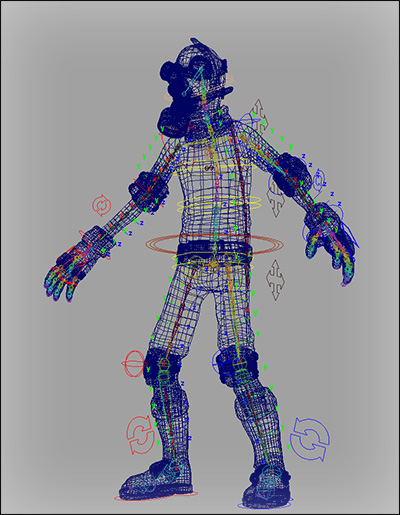

Quick Start
============

1. Get your rig ready: create joints and bind them to your mesh
------------------------------------------------------------------

To begin using ngSkinTools, you first need to have a skinCluster bound mesh. Either open one of your existing rigs, or load up a new mesh and bind it to joints using smooth bind (:guilabel:`Skin > Bind Skin > Smooth Bind`).

Typically, you might have other deformers in deformation chain after skin cluster - for example, poly smooth node; you might have to turn them off, it it's changing vertex order. In general, same rules apply here as with standard Paint Skin Weights Tool - if you can use it to paint weights on your mesh (which indicates that skinCluster node can be properly resolved from selected mesh, and vertex order is intact), ngSkinTools should behave properly as well.

2. Initialize skinning layers setup for your mesh
-------------------------------------------------

When you open up ngSkinTools dialog and select your mesh, most of the UI will be disabled as plugin needs some more additional setup to be done before you can use all the features of ngSkinTools on your mesh. When you select the mesh, you should see something similar to this:

This shows the discovered mesh shape from your selection, and skin cluster that is attached to it. Click "Initialize Skinning Layers" button. This attaches a temporary node in the scene that will store skinning layers information for the selected skin cluster. 

The mesh is now reading for working with skinning layers. On the left you can see the initial first layer created that has all original weights on skin cluster. This is where you can add/remove/arrange layers, also select active one to work on. On the right there's influence list. This list is used to select influence to paint weights for, or a group of influences for some other operations.

3. Start painting weights
--------------------------

Painting is  similar to how it is done with "Paint Skin Weights Tool" in Maya. First, enter paint tool by clicking "Paint" button in the "Paint" tab.

Now, select layer in layer list, influence in influence list, and, using one of the paint tools (Replace, Add, Scale or Smooth) start editing weights. Paint modes work similar to  what they do in other Maya tools:

1. **Replace**: sets weight for an influence to specified value; when reducing weight, remainder is distributed to other influences in the layer; if there are no other influences in the layer, layer transparency is created instead.

   .. note:: use CTRL key on windows to invert intensity value. Intensity 1.0 becomes 0.0, and 0.9 becomes 0.1, etc. 

   .. note:: use SHIFT key on Windows to enter Smooth mode while painting. 

2. **Add**: appends value to the current weight of an influence. Use this mode with low intensity values (e.g. 0.1) to slightly increase influence weights over the paint area.

3. **Scale**: multiplies current weight of an influence with intensity value. Use this mode to reduce influence weights over paint area when using high intensity values, like 0.9 or other values close to 1.0.

4. **Smooth**: smooth weights in a paint area. This tool affects all influences, unless layer mask is selected. Weights are averaged slightly and deformation appears smoother.

   .. note:: to smooth whole layer, instead of painting, use :guilabel:`Flood` to smooth whole selection. Use low intensity values and repeat operation until you're satisfied with results.
   
As everywhere else in Maya, you can change brush radius by holding "B" button and left-dragging with the mouse.

4. Mirror as you paint
----------------------

A lot of rigs are symmetric, at least parts of them are. Mirroring is a bit easier with ngSkinTools, once mesh is prepared for it.

To begin using mirror function (via :guilabel:`Mirror` button in :guilabel:`Paint` tab, or from the :guilabel:`Mirror` tab), you have to initialize mirror information first. 

.. image:: _img/mirror.jpg

Put your rig into neutral position, go to :guilabel:`Mirror` tab and click :guilabel:`Initialize`. In the dialog that opens, click :guilabel:`Initialize` to accept default options. 

Mirror is now available for the mesh. You only have to repeat initialization procedure if you add more influences to the rig later.

Mirroring is simple - choose which direction to mirror (from left to right side or vice versa), select layers to mirror (you can select multiple layers holding Shift or Ctrl buttons), and click :guilabel:`Mirror`.

.. note:: Organize your layers so that asymmetric parts are in separate layers, so you can select which parts you want to mirror to the other side and what stays intact.

See :doc:`mirroring` section for more detailed explanations of mirroring options.

5. Use layers!
--------------

Any non-trivial rig has multiple logical parts - arms, legs, palms, feet, a head or two - these all most often use different sets of influences, and when having finished with some area, you want to keep that intact. Previously you probably used influence locking; that's not needed anymore as layers let you work more efficiently. Layer "upper arm" can only have influences for bendy arm section, "torso" - spine and hip influences, and you can be sure that when you edit "head" layer, previous two will stay as they are.

6. Use vertex selections
-------------------------

NgSkinTools respects your vertex selection and work well with both regular and smooth vertex selections, so you can limit effects of any function by selecting just the area you want to edit. Sometimes it's faster to select a group of vertices and flood-smooth those instead of grooming with a brush.  

6. Get familiar with other helper functions
-------------------------------------------

* **Relax** provides more ways to smooth weights, you'll prefer this one for dense meshes instead of smooth-flooding. It also can smooth across mesh boundaries, when you have to deal with thin double-sided or disconnected surfaces.

* **Assign Weights - From Closest Joint** - a handy tool when dealing with spines, tails, and other areas where you have a chain of joints. Create a separate layer, select your influences in influence list, and click :guilabel:`Assign`. Each vertex will be weighted with value 1.0 to the joint it is closest to. Flood-smooth or Relax the layer to your liking, paint layer mask, and you're immediately done with like 10 joints in no time.

* **Assign Weights - Unify Weights** - use this one to make deformation appear more rigid for selected areas of the mesh. The function calculates average weighting for all selected vertices, and then applies that result to those vertices. That is done separately for each shell in the mesh. 

