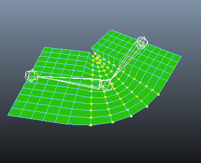
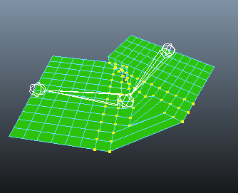
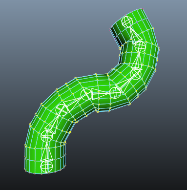
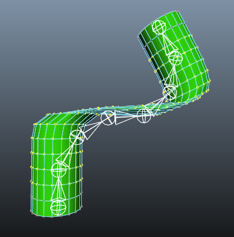
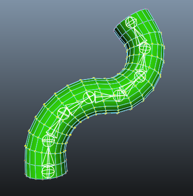

.. _wr-explained:

=======================
Weights Relax Explained
=======================

What is Weights Relax?
----------------------
Weight relaxing is an automatic way of 
effectively smoothing skin weights.

|relax-before| |relax-after|

How It Works?
-------------

* Weights Relax is a small simulation. It uses various criteria, both internal
  and customizable by user, to find irregularities in weighting, and tries to minimize them.
  It works a lot like various mesh smoothing tools, but it operates on skin weights
  instead of mesh position.

* It's not smoothing mesh, it's smoothing weights.
  If model's mesh is initially non-smooth, it will remain so no matter how much weight relaxing
  you apply.

Comparison with other skin smoothing tools
-------------------------------------------

Maya supports two means of skin weights smoothing:
:menuselection:`Edit Smooth Skin-->Smooth Skin Weights`
and
:menuselection:`Edit Smooth Skin-->Paint Skin Weights Tool-->smooth`.
Both of them have their own flaws:

* :menuselection:`Paint-->smooth`: allows smoothing one influence at a time, which is very
  unproductive - in order to fix a deformation of a given vertex, one must find exactly
  which influence got bad weights, smooth weights on it, then check if this operation 
  is not breaking weighting on other influences

* :menuselection:`Smooth Skin Weights`: it is not preserving already painted weights - new weights
  are calculated from vertices that surround your current selection.
  Anything inside selection is lost; there's no way to control amount of smoothness being applied.
	  
This means that with standard tools it's not possible to take this cylinder and
ask Maya, "can you smooth this weighting a bit"?:

Trying to paint smooth weights one by one would be a tedious process.
Using  :menuselection:`Smooth Skin Weights` would completely discard weights
on all joints but first and last one.

Smoothing skin weights with relax does not have such problems, so it is possible
to smooth all weights on all joints.

	

Non-Uniformly Spaced Mesh
-------------------------

One of under-the-hood feature of Weights Relax is that it understands mesh
topology better, smoothing weights better on non-uniformly spaced mesh.
Typically you'd find such topology around creases. 

Using Soft Selection
--------------------

Soft selection settings help you automatically modify weights 
outside vertex selection, so that weight modifications are blended
in a much smoother way.

Imagine if you want to fix weights just one vertex, but to do that,
you need

Conclusion
----------

* Allows "rough" weighting 
