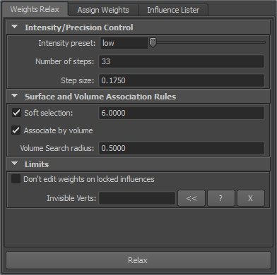
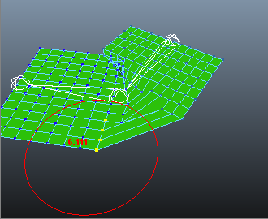

Weights Relax Interface
=======================

Quick Start
-----------------

Basic steps of using weight relaxing are:

#. Pose your rig so that bad weighting can be seen better.
   this step is not required for weight relax, but will help 
   you spot problems in weighting, as well as see how it changes
   after relaxing.
#. Select mesh vertices that need better weighting. Stick to small selection
   regions, this will make weight editing more local, and will help relax 
   run much faster. 
#. Choose relax intensity. easiest way to do that is just using
   a preset slider, which can choose simulation values for low, medium
   or high relax intensity.
#. Until you're not sure about other settings, just turn off for now:
	* Soft selection
	* Associate by volume
#. Hit relax button and see your weighting improve. If it's smoothing too much, lower intensity. 
#. See below for more Weights Relax options.

.. note::
	Weights Relax is designed to be used side-by-side with your current skinning workflow, so you may as well,
	for example, use Paint Skin Weights tool simultaneously to quickly adjust weights here and there by hand,
	then re-relax areas than need smoothing again. The only thing that changes is that you don't have to worry
	about painting skin weights as precisely as you used to.

Interface Step-By-Step
-----------------------

|interface-relax|

	
	
Intensity/Precision Control
~~~~~~~~~~~~~~~~~~~~~~~~~~~~
These settings control intensity and precision
of one relax operation. If you're not unsure about settings,
just use intensity preset slider, which allows setting approximate
values for low or high relax intensity.  
  
* :guilabel:`Intensity Preset`
	Dragging this slider 
	sets "number of steps" and "step size" corresponding to
	low, medium or high overall relax intensity.
   
* :guilabel:`Number of Steps`
	Total amount of iterations in relax simulation.
	Higher values result in higher intensity. 
	Recommended values: between ``20`` and ``50``.

	.. note:: 
			
		Choosing extremely high "steps" value will result in poor relax performance.  
   
* :guilabel:`Step Size`
	Amount of relax performed in each relax iteration, measured in
	fractions of ``1.0``. 
	Lower values mean that relax operation will be more precise, but will lessen the 
	intensity of relax effect (thus requiring increase in ``steps`` value).
	Recommended values are  between ``0.02`` and ``0.15``. 

Intensity/Precision Control
~~~~~~~~~~~~~~~~~~~~~~~~~~~~

* :guilabel:`Soft Selection`

	.. index::
		pair: Soft Selection; Weights Relax
	

	Enables/disables soft selection weight editing. Soft selection 
	radius is measured in scene units.
	Soft selection is a special weights editing mode where some 
	weights outside selection are also modified slightly.
	
	.. note:: 
			
		Carefully choose soft selection radius: high values will result
		in editing vertices that are too far from selection, which might not
		be intentional. While this does not break relax operation in any way,
		repeatedly smoothing large vertex selections creates blurry weighting. 
		  

	.. note::
		
		Instead of guessing the radius for soft selection setting,
		you can quickly measure local distance using brush
		resize hotkey: :kbd:`B+left mouse drag`. For example, judging
		from this screenshot, if you want to expand relax effect about 5 edges away
		from original selection, set radius to approximately ``6.0``.

 		|img-chooseradius|
 		
	

